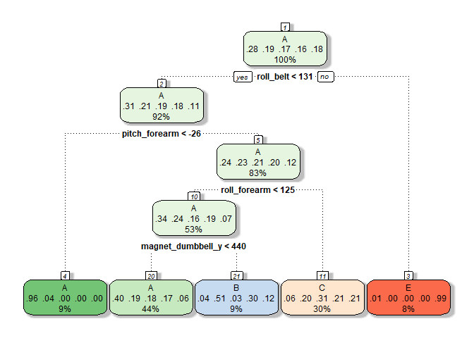
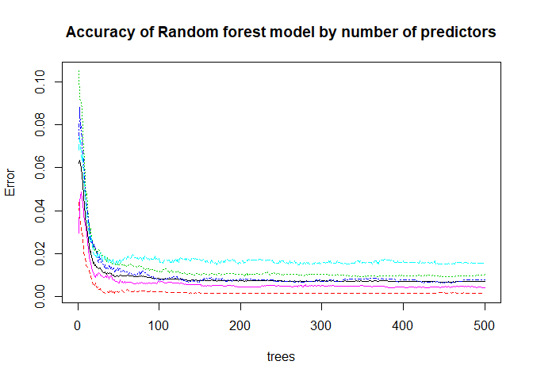

Background
----------

Using devices such as Jawbone Up, Nike FuelBand, and Fitbit it is now
possible to collect a large amount of data about personal activity
relatively inexpensively. These type of devices are part of the
quantified self movement - a group of enthusiasts who take measurements
about themselves regularly to improve their health, to find patterns in
their behavior, or because they are tech geeks. One thing that people
regularly do is quantify how much of a particular activity they do, but
they rarely quantify how well they do it.

In this project, the goal will be to use data from accelerometers on the
belt, forearm, arm, and dumbell of 6 participants. They were asked to
perform barbell lifts correctly and incorrectly in 5 different ways.
More information is available from the website here:
<http://web.archive.org/web/20161224072740/http:/groupware.les.inf.puc-rio.br/har>

Loading Libraries and reading data
----------------------------------

    library(caret)

    ## Loading required package: lattice

    ## Loading required package: ggplot2

    library(rpart)
    library(rattle)

    ## Rattle: A free graphical interface for data science with R.
    ## XXXX 5.2.0 Copyright (c) 2006-2018 Togaware Pty Ltd.
    ## Type 'rattle()' to shake, rattle, and roll your data.

    library(randomForest)

    ## randomForest 4.6-14

    ## Type rfNews() to see new features/changes/bug fixes.

    ## 
    ## Attaching package: 'randomForest'

    ## The following object is masked from 'package:rattle':
    ## 
    ##     importance

    ## The following object is masked from 'package:ggplot2':
    ## 
    ##     margin

    pml_training <- read.csv(url("https://d396qusza40orc.cloudfront.net/predmachlearn/pml-training.csv"),header=TRUE, na.strings=c("","NA"))
    dim(pml_training)

    ## [1] 19622   160

    pml_testing <- read.csv(url("https://d396qusza40orc.cloudfront.net/predmachlearn/pml-testing.csv"),header=TRUE, na.strings = c("","NA"))
    dim(pml_testing)

    ## [1]  20 160

Clean the data
--------------

-   Remove columns with missing value using the function is.na.
-   Remove the first seven columns, which informations are not related
    with the predict classification.
-   Reduced the data to 53 variables.

<!-- -->

    pml_training<- pml_training[,colSums(is.na(pml_training)) == 0]
    pml_testing<- pml_testing[,colSums(is.na(pml_testing)) == 0]
    pml_training<- pml_training[,-c(1:7)]
    pml_testing<- pml_testing[,-c(1:7)]
    dim(pml_training)

    ## [1] 19622    53

    dim(pml_testing)

    ## [1] 20 53

Create Training & Cross Validation Datasets
-------------------------------------------

The training set is used for training and for validation, in 70/30
proportion.

    inTrain = createDataPartition(pml_training$classe, p = 0.7)[[1]]
    training =pml_training[ inTrain,]
    testing = pml_training[-inTrain,]

Predictive Model with classification trees
------------------------------------------

A classification tree model is created with 13737 experiments of the
training set. A decision tree will be ploted.

    set.seed(12345)
    trainControl <- trainControl(method="cv", number=3, verboseIter=F)
    modFit<- train(classe~., data=training, method="rpart", trControl=trainControl)
    fancyRpartPlot(modFit$finalModel,sub="")

    pred <- predict(modFit,newdata=testing)
    cm_ct <- confusionMatrix(testing$classe,pred)
    cm_ct$table

    ##           Reference
    ## Prediction    A    B    C    D    E
    ##          A 1515   28  128    0    3
    ##          B  491  293  355    0    0
    ##          C  495   14  517    0    0
    ##          D  436  156  372    0    0
    ##          E  158   59  370    0  495

    cm_ct$overall[1]

    ##  Accuracy 
    ## 0.4791844

-   The accuracy of this model is about 49%, which is very low and means
    that the outcome class predicted not very well.

Predictive Model with Random Forest
-----------------------------------

Next, a new model with random forest will be created and tested.

    modFit1 <- train(classe ~., method="rf", data=training, trControl=trainControl)
    modFit1$finalModel

    ## 
    ## Call:
    ##  randomForest(x = x, y = y, mtry = param$mtry) 
    ##                Type of random forest: classification
    ##                      Number of trees: 500
    ## No. of variables tried at each split: 27
    ## 
    ##         OOB estimate of  error rate: 0.7%
    ## Confusion matrix:
    ##      A    B    C    D    E class.error
    ## A 3900    4    0    0    2 0.001536098
    ## B   19 2631    7    1    0 0.010158014
    ## C    0   10 2378    8    0 0.007512521
    ## D    0    1   29 2217    5 0.015541741
    ## E    0    0    4    6 2515 0.003960396

    plot(modFit1$finalModel,main="Accuracy of Random forest model by number of predictors")

    pred1 <- predict(modFit1,newdata=testing)
    cm_rf <- confusionMatrix(testing$classe,pred1)
    cm_rf$table

    ##           Reference
    ## Prediction    A    B    C    D    E
    ##          A 1673    0    1    0    0
    ##          B    7 1126    6    0    0
    ##          C    0    7 1018    1    0
    ##          D    0    0   12  951    1
    ##          E    0    1    3    5 1073

    cm_rf$overall[1]

    ##  Accuracy 
    ## 0.9925234

    # Compute the variable importance 
    varImp(modFit1)

    ## rf variable importance
    ## 
    ##   only 20 most important variables shown (out of 52)
    ## 
    ##                      Overall
    ## roll_belt             100.00
    ## pitch_forearm          58.61
    ## yaw_belt               52.34
    ## roll_forearm           44.39
    ## pitch_belt             43.89
    ## magnet_dumbbell_y      43.60
    ## magnet_dumbbell_z      42.37
    ## accel_dumbbell_y       20.94
    ## accel_forearm_x        18.15
    ## roll_dumbbell          16.81
    ## magnet_belt_z          16.58
    ## magnet_dumbbell_x      16.21
    ## magnet_forearm_z       15.44
    ## total_accel_dumbbell   13.91
    ## magnet_belt_y          13.88
    ## accel_dumbbell_z       13.07
    ## accel_belt_z           13.03
    ## gyros_belt_z           11.29
    ## yaw_arm                11.10
    ## magnet_belt_x           9.60

-   With random forest model, the accuracy reached of 99% using
    cross-validation with 3 steps, far superior to the rpart method. The
    specificity and sensitivity is in the high 90s for all variables.

Predictive Model with gradient boosting method
----------------------------------------------

    modFit2<-train(classe~., method="gbm", data=training, trControl=trainControl, verbose=FALSE)
    pred2<-predict(modFit2,newdata=testing)
    confusionMatrix(pred2, testing$classe)$overall['Accuracy']

    ##  Accuracy 
    ## 0.9590484

-   Precision with 3 folds, the accuracy is 96% With gradient boosting
    method.

Conclusion
----------

-   Random Forest is the best model for prediction of exercise quality
    compared to rpart and gradient boosting.
-   We will then use it to predict the values of classe for the
    pml\_testing data set.

<!-- -->

    pred_final <- predict(modFit1,newdata=pml_testing)
    pred_final

    ##  [1] B A B A A E D B A A B C B A E E A B B B
    ## Levels: A B C D E
